# Architecture

End-to-end pipeline for collecting recent Data Engineer / Analytics Engineer job postings and viewing the percentage of skills appearing across each role's postings.

```mermaid
flowchart LR

    AIRFLOW["Airflow<br/>Orchestration"]
    API["JSearch API<br/>via OpenWebNinja"]
    LAMBDA["AWS Lambda<br/>Job Extraction"]
    S3["Amazon S3<br/>Raw JSON"]
    EVENT["S3 Event Notification<br/>SQS Queue"]
    SNOWPIPE["Snowpipe<br/>Auto Ingestion"]
    RAW["Snowflake<br/>RAW_JOBS_API<br/>VARIANT"]
    SENSOR["Sensor<br/>Waits for Snowpipe load"]
    DBT["dbt"]
    STG["Staging<br/>stg_jobs<br/><i>view</i>"]
    INT["Intermediate<br/>int_jobs<br/>job skills<br/><i>incremental (merge)</i>"]:::incremental
    MARTS["Marts"]
    FACT["FACT_JOB_POSTINGS_SNAPSHOT"]:::table
    COMPANY["DIM_COMPANIES"]:::table
    LOCATION["DIM_LOCATIONS"]:::table
    SKILLS["DIM_SKILLS"]:::table
    BRIDGE["BRIDGE_JOB_SKILLS"]:::table
    ANALYSIS["dbt Analyses<br/><br/>Skill Demand<br/>Remote Roles<br/>Role Analysis"]

    AIRFLOW -->|Invokes| LAMBDA
    API -->|HTTP / JSON| LAMBDA
    LAMBDA -->|Raw JSON| S3
    S3 -->|Triggers| EVENT
    EVENT -->|Notifies| SNOWPIPE
    SNOWPIPE --> RAW

    AIRFLOW -->|Polls| SENSOR
    SENSOR -.->|Confirms load| RAW
    AIRFLOW -->|Triggers, via Cosmos| DBT

    RAW --> DBT
    DBT --> STG
    STG --> INT
    INT --> MARTS

    MARTS --> FACT
    MARTS --> COMPANY
    MARTS --> LOCATION
    MARTS --> SKILLS
    MARTS --> BRIDGE

    FACT -.->|FK| COMPANY
    FACT -.->|FK| LOCATION

    FACT --> ANALYSIS
    SKILLS --> ANALYSIS
    BRIDGE --> ANALYSIS

    classDef incremental fill:#fff3cd,stroke:#856404,stroke-width:2px;
    classDef table fill:#d1e7dd,stroke:#0f5132,stroke-width:2px;
```

**Legend:** amber = incremental model, green = table materialization, plain = view.

## Ingestion Layer

- **AWS Lambda** calls the JSearch API (hosted by OpenWebNinja, aggregating listings from LinkedIn, Indeed, Glassdoor, ZipRecruiter, and others via Google for Jobs) for a set of search queries and lands each response as raw, unmodified JSON in S3 (`raw/jobs/ingest_date=.../`).
- The API plan has a 200 requests/month quota, which constrains run frequency and query/page volume.
- Raw landing intentionally accumulates scrape history over time rather than overwriting — this history is what powers the "how long does a posting stay active" analysis later (planned; blocked this month by API quota).

## Transformation Layer (dbt)

- **stg_jobs** (view): thin 1:1 renaming/typing of the raw VARIANT payload. Kept as a view since it's cheap to recompute and always reflects the latest raw data.
- **int_jobs** (incremental, merge strategy): deduplicates multiple publishers per scrape and carries one row per job per scrape (not collapsed to "latest state"), preserving the scrape-history grain needed for active-duration metrics.
  - **Composite business key:** `job_uid` alone is not a stable identifier — it was found to repeat across different employers. `job_uid + employer_name` was validated to have no duplicates and is used to generate the `job_posting_sk` surrogate key.
  - **Incremental unique_key:** `job_uid, employer_name, scraped_at` — matches the model's actual grain (one row per job per scrape) so re-running doesn't collapse or duplicate history.
  - `on_schema_change='append_new_columns'` — since the upstream API is third-party and could add fields without notice; new columns backfill as NULL rather than failing the run outright, appropriate while the project is still under active development.
- **Marts** (tables): `FACT_JOB_POSTINGS_SNAPSHOT`, `DIM_COMPANIES`, `DIM_LOCATIONS`, `DIM_SKILLS`, `BRIDGE_JOB_SKILLS` — materialized as full tables for downstream analysis performance.

## Orchestration

The pipeline is orchestrated with **Apache Airflow**, running in Docker (`job_tracker_dag`):

1. **Invoke Lambda** — triggers the ingestion Lambda to pull job postings and land raw JSON in S3.
2. **Wait for Snowflake** — a sensor task polls the raw table until Snowpipe has finished auto-ingesting the files from step 1, avoiding race conditions between load and transform.
3. **Run dbt** — a `DbtTaskGroup` (via [astronomer-cosmos](https://github.com/astronomer/astronomer-cosmos)) runs the staging → intermediate → marts dbt models as native Airflow tasks.

The DAG is currently triggered manually (`schedule=None`); recurring scheduling is a future enhancement, subject to the API's monthly quota limits.